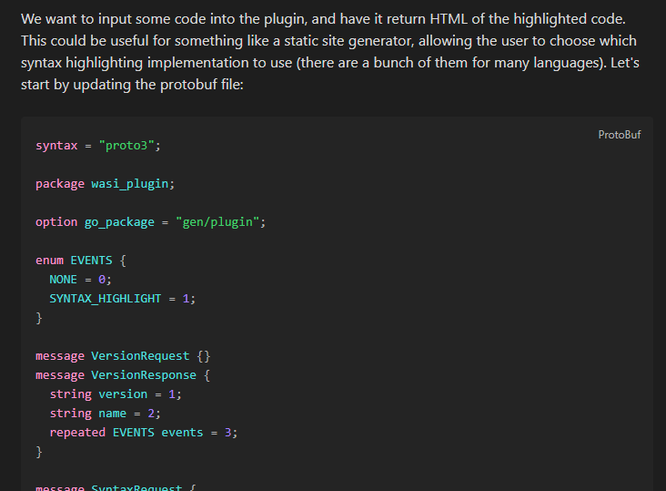

# Hugo highlight plugin

This is a plugin for [Obsidian](https://obsidian.md), which highlights lines in code blocks using the same syntax as Hugo.



## Usage

Add the `hl_lines` option after the language like this:

````markdown
```js {hl_lines=[1]}
let a = 1;
let b = 2;
```
````

`hl_lines` can be a single number, or an array of numbers/ranges (`hl_lines=[1, "2", "3-5"]`)

Only the `hl_lines` property is supported.

> [!NOTE]  
> Currently, the plugin only works in 'Live Preview' or 'Source mode'. Reader mode uses a different html presentation & syntax highlighter, which are harder to support.

## Developing this plugin

- Install dependencies: `pnpm install`
- Compile & watch changes: `pnpm dev`
- Build production release: `pnpm build`

Check the [Obsidian documentation](https://docs.obsidian.md/Plugins/Getting+started/Build+a+plugin) for more information.

If a feature you need is broken/missing, please create a new pull request instead of creating a new plugin, so that everyone can benefit :)

## Releasing new releases

- Update your `manifest.json` with your new version number, such as `1.0.1`, and the minimum Obsidian version required for your latest release.
- Update your `versions.json` file with `"new-plugin-version": "minimum-obsidian-version"` so older versions of Obsidian can download an older version of your plugin that's compatible.
- Create new GitHub release using your new version number as the "Tag version". Use the exact version number, don't include a prefix `v`. See here for an example: <https://github.com/obsidianmd/obsidian-sample-plugin/releases>
- Upload the files `manifest.json`, `main.js`, `styles.css` as binary attachments. Note: The manifest.json file must be in two places, first the root path of your repository and also in the release.
- Publish the release.

> You can simplify the version bump process by running `npm version patch`, `npm version minor` or `npm version major` after updating `minAppVersion` manually in `manifest.json`.
> The command will bump version in `manifest.json` and `package.json`, and add the entry for the new version to `versions.json`

## API Documentation

See <https://github.com/obsidianmd/obsidian-api>
